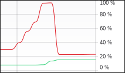
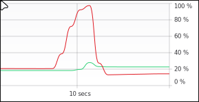
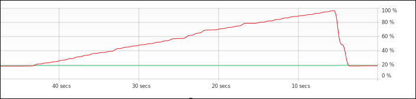

# Just because

I may or may not have a mild obsession with fork bombs

--- 

## metrics

Golang <code>int.go</code> <a href="int.go">source code</a>

Golang <code>foo.go</code> <a ref="foo.go">source code</a>

TypeScript <code>ts.ts</code> <a href="ts.ts">source code</a>

I also have a "fork-bomb" written in Zig, but it's not really a fork bomb, because Zig doesn't currently have async, unfortunately. So there is no performance graph for it, as it would take forever to max-out 8GBs of RAM in it's current state. (I might rewrite it when the async Zig update finally comes out to learn the new async)
